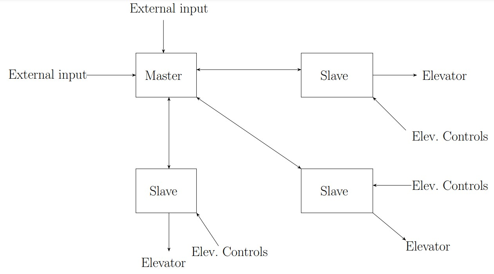

# TTK4145 Elevator Project

## Overview

This project implements a software system for controlling multiple elevators operating in parallel across multiple floors. The system is designed to handle network communication failures and ensures that no elevator calls are lost.

## TODO

Currently only a single elevator system has been implemented with a basic structure to build the network system upon.
The quality of the current code should be improved, and a vast amount of things need to be implemented, such as:

- UDP networking
- Master-Slave topology
  - Master backup and migration
  - Master merging
- Error handling
  - Acceptance testing
  - Node termination and restarting

## Project Structure

```
├── src
│   ├── main.rs        # Entry point of the application
│   ├── elevator.rs    # Elevator state and behavior implementation
│   ├── master.rs      # Coordination of multiple elevators
│   ├── prelude.rs     # Shared utilities and definitions
├── Cargo.toml         # Rust package manifest
├── README.md          # Project documentation
```

## Architecture

The system follows a modular design with the following current components:
-   **Prelude Module**: Contains shared definitions, shared structs, and utility functions used across the project.
-   **Main Module**: Entry point of the application, responsible for initializing the elevator system.
-   **Elevator Module**: Implements elevator behavior, state management, and call handling.
-   **Master Module**: Coordinates multiple elevators, assigns hall calls, and ensures proper communication between elevators.
    

## Network System

The networking between units will be implemented through a UDP-broadcast master-slave topology. The system will include a master, a slave acting as the master backup and the rest of the units will be slaves. All units will periodically broadcast their status through UDP. When a hall call is ordered the master will ensure it has been inscribed in the master backup before turning the hall light on. Should the master die, the master backup will take over. Should the master backup die a different slave will take over as the backup.

A preliminary design for the general connections of our Master-Slave setup is as follows:

